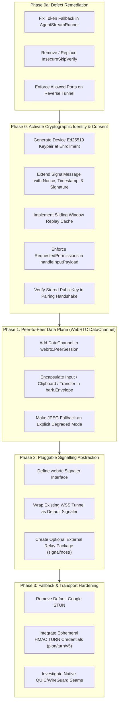

# Implementation Roadmap: Untrusted Control Plane & Swappable Signalling

**Status:** Draft / Proposed Roadmap  
**Companion RFC:** [Decentralised Signalling & Untrusted Control Plane](decentralised-signalling.md)  
**Target Packages:** `webrtc`, `tunnel`, `bark`, `input`, `clipboard`, `transfer`

---

## Executive Summary

The objective of this roadmap is to transition `remotekit` from an architecture where the control plane acts as a trusted man-in-the-middle (capable of intercepting credentials, screen frames, input, and arbitrary localhost ports) to a **zero-trust signalling model**. Under this model:

1. Endpoints authenticate cryptographically directly to each other (Ed25519 signatures over signalling messages).
2. Content (screen, input, clipboard, file transfer) is transferred peer-to-peer over WebRTC `DataChannel`s rather than transiting the central signalling server.
3. The signalling path is decoupled into an unopinionated `Signaler` interface, making transports (WebSocket, Nostr relays, local rendezvous) pluggable without altering the core.

This document details the engineering work across **Phase 0a (Defect Remediation)** through **Phase 3 (Self-Hosted Relays & Transports)**.

---

## Dependency & Phase Execution Graph



---

## Phase 0a: Immediate Defect Remediation

These fixes address immediate security issues present in the current codebase, independent of broader architectural shifts.

### 1. Fix Token Fallback in `tunnel/agent_stream.go`
* **File:** [`tunnel/agent_stream.go`](../tunnel/agent_stream.go) (lines 67–69)
* **Problem:** If `creds.AgentToken` is empty, the client headers fall back to setting `X-Barahn-Agent-Token: creds.AgentID`. This converts a public/non-secret agent identifier into an authentication credential if a downstream server accepts it.
* **Implementation Plan:**
  - Remove the fallback:
    ```go
    if r.creds.AgentToken == "" {
        return fmt.Errorf("agent_stream: cannot connect without valid AgentToken")
    }
    headers.Set("X-Barahn-Agent-Token", r.creds.AgentToken)
    ```
  - Return early with an explicit error before dialing.
* **Testing Criteria:**
  - Unit test in `agent_stream_test.go` ensuring dial fails immediately if `AgentToken` is empty.

### 2. Remediate `InsecureSkipVerify`
* **File:** [`tunnel/agent_stream.go`](../tunnel/agent_stream.go) (line 60) and [`tunnel/client.go`](../tunnel/client.go)
* **Problem:** `BARAHN_INSECURE_SKIP_VERIFY` disables TLS certificate verification globally for the client.
* **Implementation Plan:**
  - Restrict `InsecureSkipVerify` exclusively to test harnesses.
  - Implement Trust-On-First-Use (TOFU) or explicit server certificate / public key pinning based on enrollment data.
* **Testing Criteria:**
  - Verify that production builds reject non-CA-signed certs unless pinned public keys match.

### 3. Restrict Localhost Port Access in Reverse Tunnel
* **File:** [`tunnel/client.go`](../tunnel/client.go) (line 270)
* **Problem:** `OpenReverseStream` connects to `127.0.0.1:%d` without validating whether the port is permitted.
* **Implementation Plan:**
  - Introduce an allowlist configuration in `tunnel.ClientConfig`:
    ```go
    type ClientConfig struct {
        // ...
        AllowedReversePorts []int
    }
    ```
  - Reject connections to ports not explicitly present in `AllowedReversePorts`.
* **Testing Criteria:**
  - Test verifying that requests to unauthorized local ports return an immediate `ErrPortNotPermitted`.

---

## Phase 0: Activate Cryptographic Identity & Consent

**Goal:** Transform the server from a secret-holder into an untrusted witness by having endpoints cryptographically sign and verify control events.

### Technical Tasks

#### 1. Device Keypair Generation on Enrollment
* **Package:** `tunnel`, `osinfo`
* **Details:**
  - Generate an Ed25519 keypair during agent enrollment.
  - Store the private key locally with restricted filesystem permissions (e.g. `0600`) adjacent to agent configuration.
  - Populate the base64-encoded public key into `AgentRegistration.PublicKey` ([`tunnel/store.go`](../tunnel/store.go#L53)), which is sent in `Enroll()`.

#### 2. Extend `webrtc.SignalMessage` for Self-Authentication
* **File:** [`webrtc/signaling.go`](../webrtc/signaling.go)
* **Proposed Structure:**
  ```go
  type SignalMessage struct {
      Type      SignalType `json:"type"`
      SessionID string     `json:"session_id,omitempty"`
      TargetID  string     `json:"target_id,omitempty"`
      SDP       string     `json:"sdp,omitempty"`
      Candidate string     `json:"candidate,omitempty"`
      Error     string     `json:"error,omitempty"`

      // Cryptographic authentication fields
      PubKey    string     `json:"pub_key,omitempty"`    // Sender Ed25519 public key (hex or base64)
      Nonce     string     `json:"nonce,omitempty"`      // Random UUID or high-entropy nonce
      IssuedAt  int64      `json:"issued_at,omitempty"`  // Unix timestamp (seconds)
      ExpiresAt int64      `json:"expires_at,omitempty"` // Unix timestamp (seconds)
      Sig       string     `json:"sig,omitempty"`        // Ed25519 signature over canonical payload
  }
  ```
* **Methods:**
  ```go
  // CanonicalBytes returns the deterministic byte sequence used for signing.
  func (m *SignalMessage) CanonicalBytes() []byte

  // Sign signs the message using an Ed25519 private key.
  func (m *SignalMessage) Sign(privKey ed25519.PrivateKey) error

  // Verify checks the signature against PubKey and validates time bounds.
  func (m *SignalMessage) Verify(now time.Time) error
  ```

#### 3. Anti-Replay Sliding Window Cache
* **Package:** `webrtc`
* **Details:**
  - Implement a thread-safe, TTL-bounded nonce store:
    ```go
    type NonceCache struct {
        mu      sync.Mutex
        seen    map[string]int64
        window  time.Duration
    }
    func (c *NonceCache) CheckAndRecord(nonce string, expiresAt int64) bool
    ```
  - Messages with timestamps older than `now - window` or nonces already recorded are rejected.

#### 4. Enforce Session Consent
* **Files:** [`tunnel/agent_stream.go`](../tunnel/agent_stream.go#L521), [`bark/bark.go`](../bark/bark.go#L90)
* **Details:**
  - Store granted session permissions in `AgentStreamRunner`:
    ```go
    type AgentStreamRunner struct {
        // ...
        mu                 sync.RWMutex
        grantedPermissions map[string]bool
    }
    ```
  - In `handleInputPayload()`: check `grantedPermissions["remote_control"]`. If not granted, drop input event with a warning log.
  - In clipboard synchronization: check `grantedPermissions["clipboard"]` before reading or writing to the OS clipboard.
  - In chunked file transfer: check `grantedPermissions["file_transfer"]` before writing incoming chunks to disk.

---

## Phase 1: Peer-to-Peer Data Plane (WebRTC DataChannel)

**Goal:** Remove user data (screen, keystrokes, clipboard, files) from the signalling WebSocket entirely.

### Technical Tasks

#### 1. Add DataChannel to `webrtc.PeerSession`
* **File:** [`webrtc/peer.go`](../webrtc/peer.go)
* **Implementation:**
  - Introduce DataChannel initialization:
    ```go
    type PeerSession struct {
        config PeerConfig
        pc     *webrtc.PeerConnection
        videoTrack *webrtc.TrackLocalStaticSample

        dataChannel   *webrtc.DataChannel
        onDataMessage func(msg []byte)
    }

    func (s *PeerSession) OpenDataChannel(label string, onMsg func([]byte)) error
    func (s *PeerSession) SendData(data []byte) error
    ```
  - Use ordered, reliable channels for control messages (`bark-control`) and file transfers (`bark-transfer`).

#### 2. Encapsulate Data Plane Messages in `bark.Envelope`
* **Package:** `bark`, `tunnel`
* **Details:**
  - Migrate input injection payloads, clipboard sync packets, and file transfer blocks from the WebSocket loop in [`tunnel/agent_stream.go`](../tunnel/agent_stream.go#L410) onto `PeerSession.SendData()`.
  - Format every packet using standard `bark.Envelope`.
  - The central server now only relays opaque SDP and ICE candidate messages during handshake; it sees zero input or clipboard bytes.

#### 3. Explicit Degraded Mode for JPEG Fallback
* **File:** [`tunnel/agent_stream.go`](../tunnel/agent_stream.go#L83)
* **Details:**
  - The JPEG fallback currently operates silently whenever WebRTC is not confirmed (`video_ok`).
  - Change this behavior so JPEG relay streaming requires an explicit user-acknowledged configuration flag (`AllowRelayFallback: true`).
  - Emit an informational event when entering degraded relay mode so the operator and client UI display a clear indicator (*"Degraded Mode: Relayed through server"*).

---

## Phase 2: Pluggable Signalling Abstraction

**Goal:** Decouple `remotekit` from WebSocket signalling so any transport can be plugged in without changing session logic.

### Technical Tasks

#### 1. Define `Signaler` Interface
* **Package:** `webrtc` (or a dedicated `signal` package)
* **Specification:**
  ```go
  // Filter specifies which signal messages an endpoint is interested in.
  type Filter struct {
      SessionID string
      TargetID  string
      Types     []SignalType
  }

  // Signaler abstracts message publication and subscription for WebRTC negotiation.
  type Signaler interface {
      // Publish broadcasts or routes a signed signal message.
      Publish(ctx context.Context, msg SignalMessage) error

      // Subscribe listens for incoming signal messages matching the filter.
      Subscribe(ctx context.Context, filter Filter) (<-chan SignalMessage, error)

      // Close terminates the signalling connection.
      Close() error
  }
  ```

#### 2. Wrap Existing WebSocket Tunnel as Default Signaler
* **File:** `tunnel/signaler.go`
* **Details:**
  - Implement `WSSignaler` satisfying the `Signaler` interface using the existing `/api/v1/sessions/:id/signal` WebSocket endpoint.
  - Ensures existing downstream consumers retain complete backward compatibility.

#### 3. Support Optional Relay Implementations (e.g. Nostr)
* **Package:** `signal/nostr` (isolated subpackage)
* **Principles:**
  - Keep `remotekit` core dependency-free: do not import Nostr libraries in root `go.mod`.
  - Use **NIP-44** for payload encryption, **NIP-59 (Gift Wrap)** for sender privacy, and **NIP-40** for event expiration.
  - Use ephemeral, per-session device keys rather than persistent identity keys to prevent device tracking on public relays.

---

## Phase 3: Hardening STUN/TURN & Transports

**Goal:** Remove external third-party dependencies and enable self-hosted, ephemeral TURN capabilities.

### Technical Tasks

#### 1. Deprecate Default Google STUN
* **File:** [`webrtc/peer.go`](../webrtc/peer.go#L44)
* **Details:**
  - Remove hardcoded `"stun:stun.l.google.com:19302"` from `DefaultPeerConfig()`.
  - Require explicit ICE server configuration, or provide fallback to self-hosted STUN services.

#### 2. Ephemeral TURN Credentials with `pion/turn/v5`
* **Package:** `webrtc`
* **Details:**
  - `pion/turn/v5` is already present as an indirect dependency in `go.mod`.
  - Implement time-limited HMAC-derived TURN credentials:
    ```go
    // GenerateEphemeralTURNCredentials generates time-limited user/password pairs
    // using a shared secret and expiry timestamp.
    func GenerateEphemeralTURNCredentials(sharedSecret, username string, ttl time.Duration) (user, pass string, expiresAt int64)
    ```
  - Eliminates static shared secrets that risk turning TURN servers into open relays.

#### 3. Pluggable Transport Seam (QUIC / WireGuard)
* **Package:** `tunnel`, `webrtc`
* **Details:**
  - Decouple frame streaming from WebRTC by establishing an abstract `DataTransport` interface, separating *what to send* (`bark`) from *how to send it* (`webrtc.PeerSession`).
  - Paves the way for lightweight QUIC/UDP streams on native Linux installations where WebRTC browser compatibility is not required.

---

## Verification & Test Matrix

| Phase | Milestone | Validation Strategy |
|---|---|---|
| **0a** | Empty token handling | Unit test confirming dial rejection when token is missing. |
| **0a** | Port allowlist | Unit test asserting connection failure to unlisted ports in reverse stream. |
| **0** | `SignalMessage` verification | Unit test verifying signature creation, tampering rejection, and expiry validation. |
| **0** | Nonce replay prevention | Unit test confirming duplicate nonce within window is rejected. |
| **0** | Consent checks | Integration test ensuring input events are dropped without `remote_control` permission. |
| **1** | WebRTC DataChannel | Loopback integration test with two `PeerSession` instances transmitting `bark.Envelope` payloads over DataChannel. |
| **1** | Degraded mode indicator | Verification that JPEG fallback emits degraded status events and requires explicit opt-in. |
| **2** | `Signaler` abstraction | Test verifying WebRTC negotiation between peers using an in-memory channel `Signaler`. |
| **3** | Ephemeral TURN | Test generating and verifying time-bounded HMAC credentials with `pion/turn/v5`. |

---

## Downstream Impact Assessment

* **Chirp (AGPL-3.0 - On-Demand Support):**
  - Directly benefits from Phase 2 and Phase 3: enables serverless, peer-to-peer ad-hoc technician connections using relays or local discovery without hosting infrastructure.
* **Barahn (Proprietary - Enterprise Fleet):**
  - Retains its central control plane for RBAC, compliance logging, and device presence.
  - Benefits immediately from Phase 0 and Phase 1: protects customer infrastructure against compromise of the control plane server by ensuring end-to-end payload encryption and cryptographic consent enforcement.
