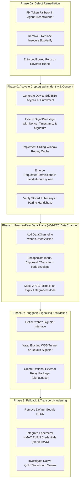

# Implementation Roadmap: Untrusted Control Plane & Swappable Signalling

**Status:** Draft / Proposed Roadmap  
**Companion RFC:** [Decentralised Signalling & Untrusted Control Plane](decentralised-signalling.md)  
**Target Packages:** `webrtc`, `tunnel`, `bark`, `input`, `clipboard`, `transfer`

---

## Executive Summary

The objective of this roadmap is to transition `remotekit` from an architecture where the control plane acts as a trusted man-in-the-middle (capable of intercepting credentials, screen frames, input, and arbitrary localhost ports) to a **zero-trust signalling model**. Under this model:

1. Endpoints authenticate cryptographically directly to each other (Ed25519 signatures over signalling messages).
2. Content (screen, input, clipboard, file transfer) is transferred peer-to-peer over WebRTC `DataChannel`s rather than transiting the central signalling server.
3. The signalling path is decoupled into an unopinionated `Signaler` interface, making transports (WebSocket, Nostr relays, local rendezvous) pluggable without altering the core.

This document details the engineering work across **Phase 0a (Defect Remediation)** through **Phase 3 (Self-Hosted Relays & Transports)**.

---

## Dependency & Phase Execution Graph



---

## Phase 0a: Immediate Defect Remediation

These fixes address immediate security issues present in the current codebase, independent of broader architectural shifts.

### 1. Fix Token Fallback in `tunnel/agent_stream.go`
* **File:** [`tunnel/agent_stream.go`](../tunnel/agent_stream.go) (lines 67–69)
* **Problem:** If `creds.AgentToken` is empty, the client headers fall back to setting `X-Barahn-Agent-Token: creds.AgentID`. This converts a public/non-secret agent identifier into an authentication credential if a downstream server accepts it.
* **Implementation Plan:**
  - Remove the fallback:
    ```go
    if r.creds.AgentToken == "" {
        return fmt.Errorf("agent_stream: cannot connect without valid AgentToken")
    }
    headers.Set("X-Barahn-Agent-Token", r.creds.AgentToken)
    ```
  - Return early with an explicit error before dialing.
* **Testing Criteria:**
  - Unit test in `agent_stream_test.go` ensuring dial fails immediately if `AgentToken` is empty.

### 2. Remediate `InsecureSkipVerify`
* **File:** [`tunnel/agent_stream.go`](../tunnel/agent_stream.go) (line 60) and [`tunnel/client.go`](../tunnel/client.go)
* **Problem:** `BARAHN_INSECURE_SKIP_VERIFY` disables TLS certificate verification globally for the client.
* **Implementation Plan:**
  - Restrict `InsecureSkipVerify` exclusively to test harnesses.
  - Implement Trust-On-First-Use (TOFU) or explicit server certificate / public key pinning based on enrollment data.
* **Testing Criteria:**
  - Verify that production builds reject non-CA-signed certs unless pinned public keys match.

### 3. Restrict Localhost Port Access in Reverse Tunnel
* **File:** [`tunnel/client.go`](../tunnel/client.go) (line 270)
* **Problem:** `OpenReverseStream` connects to `127.0.0.1:%d` without validating whether the port is permitted.
* **Implementation Plan:**
  - Introduce an allowlist configuration in `tunnel.ClientConfig`:
    ```go
    type ClientConfig struct {
        // ...
        AllowedReversePorts []int
    }
    ```
  - Reject connections to ports not explicitly present in `AllowedReversePorts`.
* **Testing Criteria:**
  - Test verifying that requests to unauthorized local ports return an immediate `ErrPortNotPermitted`.

---

## Phase 0: Activate Cryptographic Identity & Consent

**Goal:** Transform the server from a secret-holder into an untrusted witness by having endpoints cryptographically sign and verify control events.

### Technical Tasks

#### 1. Device Keypair Generation on Enrollment
* **Package:** `tunnel`, `osinfo`
* **Details:**
  - Generate an Ed25519 keypair during agent enrollment.
  - Store the private key locally with restricted filesystem permissions (e.g. `0600`) adjacent to agent configuration.
  - Populate the base64-encoded public key into `AgentRegistration.PublicKey` ([`tunnel/store.go`](../tunnel/store.go#L53)), which is sent in `Enroll()`.

#### 2. Extend `webrtc.SignalMessage` for Self-Authentication
* **File:** [`webrtc/signaling.go`](../webrtc/signaling.go)
* **Proposed Structure:**
  ```go
  type SignalMessage struct {
      Type      SignalType `json:"type"`
      SessionID string     `json:"session_id,omitempty"`
      TargetID  string     `json:"target_id,omitempty"`
      SDP       string     `json:"sdp,omitempty"`
      Candidate string     `json:"candidate,omitempty"`
      Error     string     `json:"error,omitempty"`

      // Cryptographic authentication fields
      PubKey    string     `json:"pub_key,omitempty"`    // Sender Ed25519 public key (hex or base64)
      Nonce     string     `json:"nonce,omitempty"`      // Random UUID or high-entropy nonce
      IssuedAt  int64      `json:"issued_at,omitempty"`  // Unix timestamp (seconds)
      ExpiresAt int64      `json:"expires_at,omitempty"` // Unix timestamp (seconds)
      Sig       string     `json:"sig,omitempty"`        // Ed25519 signature over canonical payload
  }
  ```
* **Methods:**
  ```go
  // CanonicalBytes returns the deterministic byte sequence used for signing.
  func (m *SignalMessage) CanonicalBytes() []byte

  // Sign signs the message using an Ed25519 private key.
  func (m *SignalMessage) Sign(privKey ed25519.PrivateKey) error

  // Verify checks the signature against PubKey and validates time bounds.
  func (m *SignalMessage) Verify(now time.Time) error
  ```

#### 3. Anti-Replay Sliding Window Cache
* **Package:** `webrtc`
* **Details:**
  - Implement a thread-safe, TTL-bounded nonce store:
    ```go
    type NonceCache struct {
        mu      sync.Mutex
        seen    map[string]int64
        window  time.Duration
    }
    func (c *NonceCache) CheckAndRecord(nonce string, expiresAt int64) bool
    ```
  - Messages with timestamps older than `now - window` or nonces already recorded are rejected.

#### 4. Enforce Session Consent
* **Files:** [`tunnel/agent_stream.go`](../tunnel/agent_stream.go#L521), [`bark/bark.go`](../bark/bark.go#L90)
* **Details:**
  - Store granted session permissions in `AgentStreamRunner`:
    ```go
    type AgentStreamRunner struct {
        // ...
        mu                 sync.RWMutex
        grantedPermissions map[string]bool
    }
    ```
  - In `handleInputPayload()`: check `grantedPermissions["remote_control"]`. If not granted, drop input event with a warning log.
  - In clipboard synchronization: check `grantedPermissions["clipboard"]` before reading or writing to the OS clipboard.
  - In chunked file transfer: check `grantedPermissions["file_transfer"]` before writing incoming chunks to disk.

---

## Phase 1: Peer-to-Peer Data Plane (WebRTC DataChannel)

**Goal:** Remove user data (screen, keystrokes, clipboard, files) from the signalling WebSocket entirely.

### Technical Tasks

#### 1. Add DataChannel to `webrtc.PeerSession`
* **File:** [`webrtc/datachannel.go`](../webrtc/datachannel.go)
* **Direction:** the viewer makes the offer and the agent answers, so the
  viewer creates the channels and the agent accepts them (`OnDataChannel`).
  An earlier draft of this section had the agent call `OpenDataChannel`; a
  channel created by the answering side would need a renegotiation the viewer
  never starts.
* **Implementation:**
  ```go
  const (
      DataChannelControl  = "bark-control"  // input, clipboard
      DataChannelTransfer = "bark-transfer" // file transfer
  )

  func (s *PeerSession) OnDataMessage(fn func(label string, msg []byte))
  func (s *PeerSession) OnDataChannelOpen(fn func(label string))
  func (s *PeerSession) DataChannelOpen(label string) bool
  func (s *PeerSession) SendData(label string, data []byte) error
  func (s *PeerSession) OpenDataChannel(label string) error // offering side: Go viewers, tests
  ```
  - Both channels are ordered and reliable. A channel the viewer opens as
    unordered, or with a retransmit or lifetime limit, is closed on arrival.
  - The viewer runs in the products (Chirp, Barahn), not in this module, so
    each product's viewer has to open the channels too. Until they do, the
    agent keeps accepting the same messages over the signalling socket.

#### 2. Encapsulate Data Plane Messages in `bark.Envelope`
* **Package:** `bark`, `tunnel` ([`tunnel/dataplane.go`](../tunnel/dataplane.go))
* **Details:**
  - Input, clipboard and file transfer (`input`, `clipboard`, `file_start`,
    `file_chunk`, `file_complete`) arrive over the viewer's data channels as
    `bark.Envelope`s whose payload has the same fields as the socket message
    of the same type. Replies (`file_progress`, `file_saved`) go back on the
    channel the message came on, as envelopes too. The host's clipboard goes
    to every viewer with an open `bark-control` channel.
  - Both paths go through one handler, so the consent checks from Phase 0
    apply identically whichever way a message arrives.
  - **Transition:** the products' viewers have to open the channels before
    the socket path can go. Until then the agent accepts both, and the host
    clipboard still goes over the socket while any viewer has no channel.
    `AgentStreamRunner.RequireDataChannel(true)` is the opt-in end state:
    user data on the socket is refused (the viewer is sent
    `{"type":"data_channel_required","message_type":...}` once per type),
    and the server only relays SDP and ICE candidates.
  - No separate signature is needed on these messages: the channel runs
    inside the DTLS session the offer and answer set up, and with
    `RequireSignedViewers` on, the relay cannot put itself in the middle of
    that session.

#### 3. Explicit Degraded Mode for JPEG Fallback
* **File:** [`tunnel/relaymode.go`](../tunnel/relaymode.go)
* **Details:**
  - The JPEG fallback used to run silently whenever WebRTC was not confirmed
    (`video_ok`). It is now always announced: entering it sends the viewer
    `{"type":"relay_mode","active":true,"reason":...}`, leaving it sends
    `active: false`, a viewer joining mid-relay is told again, and every
    transition is logged and reported to `AgentStreamRunner.OnRelayMode`, so
    the agent's own UI can show the person at the machine that the server
    can see the screen.
  - Refusing it is opt-in, not the default this section first proposed
    (`AllowRelayFallback: true`): making it mandatory would leave every
    viewer that cannot negotiate WebRTC or decode VP8 with no screen.
    `AgentStreamRunner.DisableRelayFallback(true)` refuses it; such a viewer
    is sent `{"type":"relay_fallback_refused"}` instead of frames.

---

## Phase 2: Pluggable Signalling Abstraction

**Goal:** Decouple `remotekit` from WebSocket signalling so any transport can be plugged in without changing session logic.

### As built: `SignalConn`, not a pub/sub `Signaler`

> **Since barahn/remotekit#83** the session runner lives in package `stream`,
> not `tunnel`: `stream.Runner`, built with `stream.New(stream.Config{ID,
> SigningKey})`, holds consent, signed viewers, the data-plane and relay
> rules, `Handle`, `SignalConn` and `Serve`, and imports neither `tunnel` nor
> yamux. `tunnel.AgentStreamRunner` embeds a `stream.Runner`, maps the agent
> ID and device key from `AgentCredentials` into its `Config`, and keeps
> `Start`; `tunnel.SignalConn`, `tunnel.MessageHandler`, the `Permission*`
> constants and the `ErrViewer*` errors are aliases of `stream`'s. yamux
> (MPL-2.0) now stays with `tunnel`'s enrolment and reverse-tunnel code, so an
> on-demand consumer such as Chirp serves a session through `stream` without
> it. The `tunnel/...` file references elsewhere in this document predate the
> move: `agent_stream.go`, `consent.go`, `dataplane.go`, `relaymode.go`,
> `viewerauth.go`, `handler.go` and `signalconn.go` are now under `stream/`
> (`agent_stream.go` as `runner.go`).

Tasks 1 and 2 below were built as a narrower seam than they describe, because
the signalling socket carries more than `SignalMessage`. Besides offers,
answers and candidates it carries `session_start`, `video_ok`, `chat`,
`close`, the agent's notices (`relay_mode`, `consent_required`, ...), the data
plane for viewers that predate the data channel, and every message type a
consumer registers with `AgentStreamRunner.Handle`. A `Signaler` that only
publishes and subscribes `SignalMessage` cannot carry a session.

What the session loop actually needs is one message in and one message out,
so that is the seam:

```go
type SignalConn interface {
    ReadMessage() ([]byte, error)
    WriteMessage(data []byte) error
    Close() error
}

func (r *Runner) Serve(ctx context.Context, conn SignalConn) error // package stream
```

`Start` still dials the control plane's WebSocket and reconnects; it is now
one `SignalConn` among others. `Serve` runs the same session -- negotiation,
data plane, consent, signed viewers -- over any transport a consumer supplies,
and does not reconnect. A relay transport (task 3) implements `SignalConn`
for one session, doing its own addressing and filtering inside, which is
where the `Filter` sketched below belongs.

The transport carries; it does not vouch. `RequireSignedViewers` and consent
apply the same over any `SignalConn`, and are what make an untrusted transport
safe to use.

### Technical Tasks (original proposal)

#### 1. Define `Signaler` Interface
* **Package:** `webrtc` (or a dedicated `signal` package)
* **Specification:**
  ```go
  // Filter specifies which signal messages an endpoint is interested in.
  type Filter struct {
      SessionID string
      TargetID  string
      Types     []SignalType
  }

  // Signaler abstracts message publication and subscription for WebRTC negotiation.
  type Signaler interface {
      // Publish broadcasts or routes a signed signal message.
      Publish(ctx context.Context, msg SignalMessage) error

      // Subscribe listens for incoming signal messages matching the filter.
      Subscribe(ctx context.Context, filter Filter) (<-chan SignalMessage, error)

      // Close terminates the signalling connection.
      Close() error
  }
  ```

#### 2. Wrap Existing WebSocket Tunnel as Default Signaler
* **File:** `tunnel/signaler.go`
* **Details:**
  - Implement `WSSignaler` satisfying the `Signaler` interface using the existing `/api/v1/sessions/:id/signal` WebSocket endpoint.
  - Ensures existing downstream consumers retain complete backward compatibility.

#### 3. Support Optional Relay Implementations (e.g. Nostr)

**As built:** `signal/nostr`, a separate Go module (its `go.mod` replaces the
core with the tree, and CI runs it as its own job). `Listen` opens the agent's
end and `Dial` a viewer's; both return a `*Conn` satisfying
`stream.SignalConn`, so a session runs over relays with
`stream.Runner.Serve`. Each message is a NIP-59 gift wrap -- an unsigned
rumor of our own kind 21059, sealed (kind 13) and signed by the sender,
wrapped (kind 1059) under a one-time key, both layers NIP-44 v2 -- with a
NIP-40 expiration. Relays see the recipient's key and nothing of the sender or
the content. Keys are generated per session unless the caller supplies one.
A Listen conn sets each message's `viewer_id` to the key that sealed it,
overwriting whatever the message claimed, and routes replies by it; it caps
how many viewers it will talk to. NIP-44 is checked against the published
test vectors, and the whole path, including a signed WebRTC negotiation
through `Serve`, is tested against an in-process relay. Not built: relay
redialling (a Conn ends with its last relay) and NIP-42 relay auth.

* **Package:** `signal/nostr` (isolated subpackage)
* **Principles:**
  - Keep `remotekit` core dependency-free: do not import Nostr libraries in root `go.mod`.
  - Use **NIP-44** for payload encryption, **NIP-59 (Gift Wrap)** for sender privacy, and **NIP-40** for event expiration.
  - Use ephemeral, per-session device keys rather than persistent identity keys to prevent device tracking on public relays.

---

## Phase 3: Hardening STUN/TURN & Transports

**Goal:** Remove external third-party dependencies and enable self-hosted, ephemeral TURN capabilities.

### Technical Tasks

#### 1. Deprecate Default Google STUN
* **File:** [`webrtc/peer.go`](../webrtc/peer.go#L44)
* **Details:**
  - Remove hardcoded `"stun:stun.l.google.com:19302"` from `DefaultPeerConfig()`.
  - Require explicit ICE server configuration, or provide fallback to self-hosted STUN services.

#### 2. Ephemeral TURN Credentials with `pion/turn/v5`
* **Package:** `webrtc`
* **Details:**
  - `pion/turn/v5` is already present as an indirect dependency in `go.mod`.
  - Implement time-limited HMAC-derived TURN credentials:
    ```go
    // GenerateEphemeralTURNCredentials generates time-limited user/password pairs
    // using a shared secret and expiry timestamp.
    func GenerateEphemeralTURNCredentials(sharedSecret, username string, ttl time.Duration) (user, pass string, expiresAt int64)
    ```
  - Eliminates static shared secrets that risk turning TURN servers into open relays.

#### 3. Pluggable Transport Seam (QUIC / WireGuard)
* **Package:** `tunnel`, `webrtc`
* **Details:**
  - Decouple frame streaming from WebRTC by establishing an abstract `DataTransport` interface, separating *what to send* (`bark`) from *how to send it* (`webrtc.PeerSession`).
  - Paves the way for lightweight QUIC/UDP streams on native Linux installations where WebRTC browser compatibility is not required.

---

## Verification & Test Matrix

| Phase | Milestone | Validation Strategy |
|---|---|---|
| **0a** | Empty token handling | Unit test confirming dial rejection when token is missing. |
| **0a** | Port allowlist | Unit test asserting connection failure to unlisted ports in reverse stream. |
| **0** | `SignalMessage` verification | Unit test verifying signature creation, tampering rejection, and expiry validation. |
| **0** | Nonce replay prevention | Unit test confirming duplicate nonce within window is rejected. |
| **0** | Consent checks | Integration test ensuring input events are dropped without `remote_control` permission. |
| **1** | WebRTC DataChannel | Loopback integration test with two `PeerSession` instances transmitting `bark.Envelope` payloads over DataChannel. |
| **1** | Degraded mode indicator | Verification that JPEG fallback emits degraded status events and requires explicit opt-in. |
| **2** | `Signaler` abstraction | Test verifying WebRTC negotiation between peers using an in-memory channel `Signaler`. |
| **3** | Ephemeral TURN | Test generating and verifying time-bounded HMAC credentials with `pion/turn/v5`. |

---

## Downstream Impact Assessment

* **Chirp (AGPL-3.0 - On-Demand Support):**
  - Directly benefits from Phase 2 and Phase 3: enables serverless, peer-to-peer ad-hoc technician connections using relays or local discovery without hosting infrastructure.
* **Barahn (Proprietary - Enterprise Fleet):**
  - Retains its central control plane for RBAC, compliance logging, and device presence.
  - Benefits immediately from Phase 0 and Phase 1: protects customer infrastructure against compromise of the control plane server by ensuring end-to-end payload encryption and cryptographic consent enforcement.
